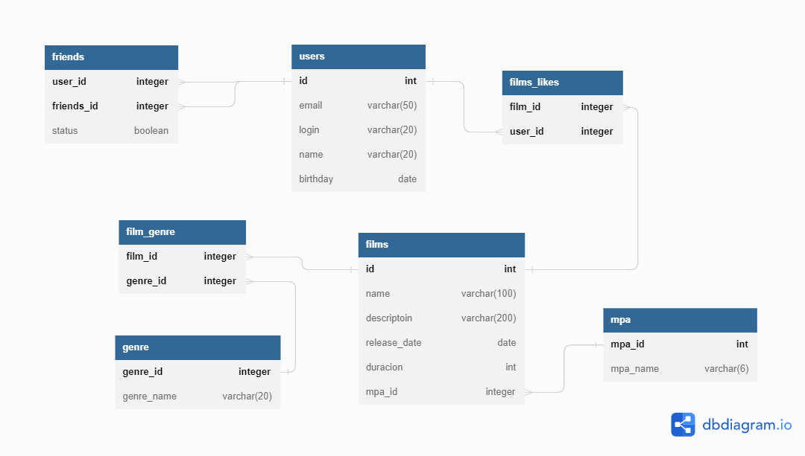

# Приложение Filmorate
## ER-диаграмма

## Примеры SQL-запросов
###### Получение всех пользователей:
```
SELECT *
FROM users;
```
###### Получение пользователя по id:
```
SELECT *
FROM users
WHERE user_id = id;
```
###### Получение списка друзей пользователя по id:
```
SELECT friend_with
FROM user_friends
WHERE user_id = id AND confirmed IS TRUE;
```
###### Получение списка общих друзей пользователей по id и otherId:
```
SELECT uf.user_id
FROM user_friends AS uf
WHERE uf.user_id IN (SELECT user_id,
                            friend_with
                     FROM user_friends
                     WHERE user_id = other_id AND confirmed IS TRUE)
AND user_id = id AND confirmed IS TRUE;
```
###### Получение всех фильмов:
```
SELECT *
FROM films;
```
###### Получение фильма по id:
```
SELECT *
FROM films
WHERE film_id = id;
```
###### Получение списка id пользователей, поставивших лайк фильму по id:
```
SELECT liked_by
FROM film_likes
WHERE film_id = id;
```
###### Получение списка топ N самых популярных фильмов:
```
SELECT *
FROM films AS f
WHERE f.film_id IN (SELECT film_id,
                           COUNT(liked_by) AS likes_count
                    FROM film_likes
                    GROUP BY film_id
                    ORDER BY likes_count DESC
                    LIMIT <N>);
```

